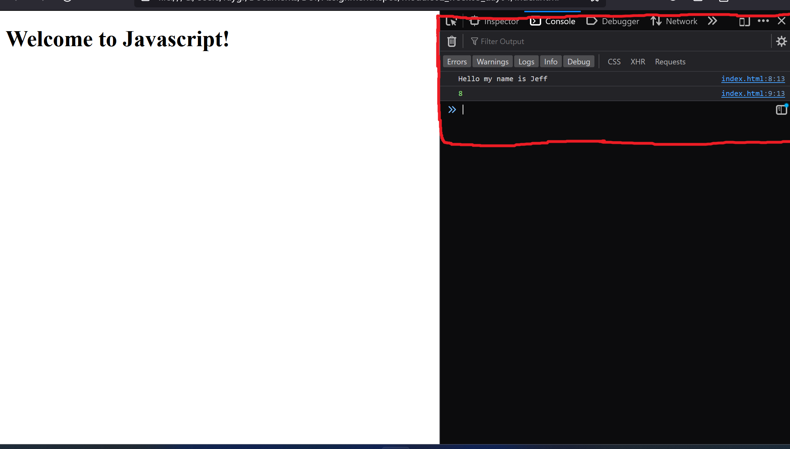

# Intro to Javascript

## Assignment: Creating and Using Variables

In this assignment, you will practice creating and using variables in JavaScript to store and manipulate data.

### Instructions

1. In the HTML file, add a `<script>` tag (index.html)

2. Inside the script tag, create and work with the following variables:

   - **String Variable:** Declare a variable named `name` and assign your first name as a string to it.

   - **Number Variables:** Declare two variables, `num1` and `num2`, and assign numeric values (integers or floats) to them.
     - assign a value of 3 to `num1`
     - assign a value of 5 to `num2`  

3. Perform the following operations with these variables:
   
   - Concatenate (combine) `name` variable with the string 'Hello my name is ' to create a greeting message and display it using `console.log()`.

   - Add the variables `num1` and `num2` together and display the results using `console.log()`.

Take a look at Example.png to see what the console output should look like.
